Portfolio to Microverse course

# Portfolio Microverse

> Capstone Projects using HTML, CSS, JavaScript

### Check out in this [link](https://hendridg.github.io/capstone-module-1/)

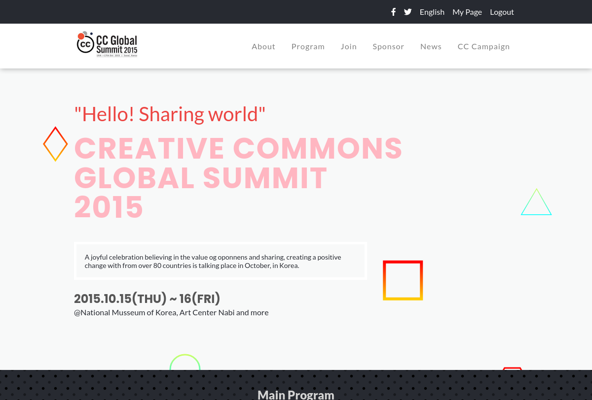
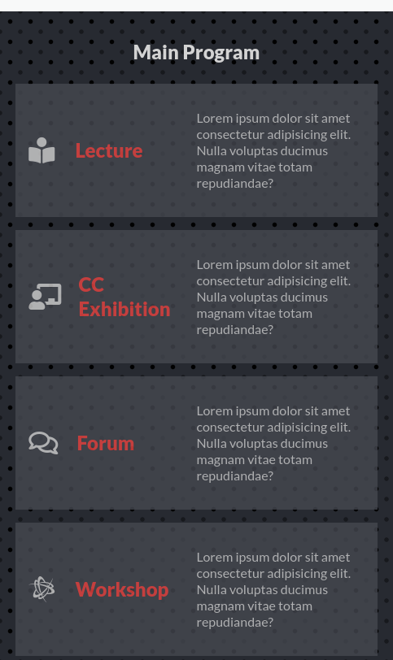
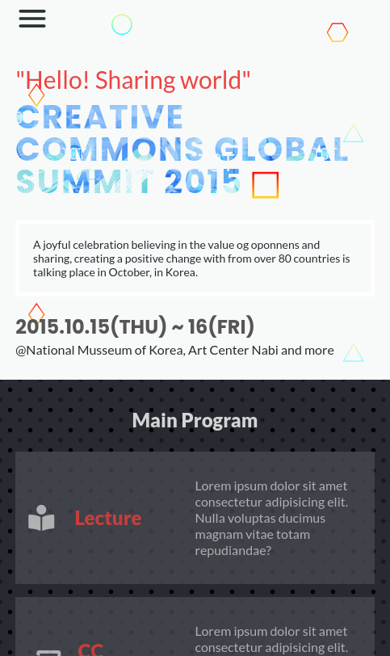
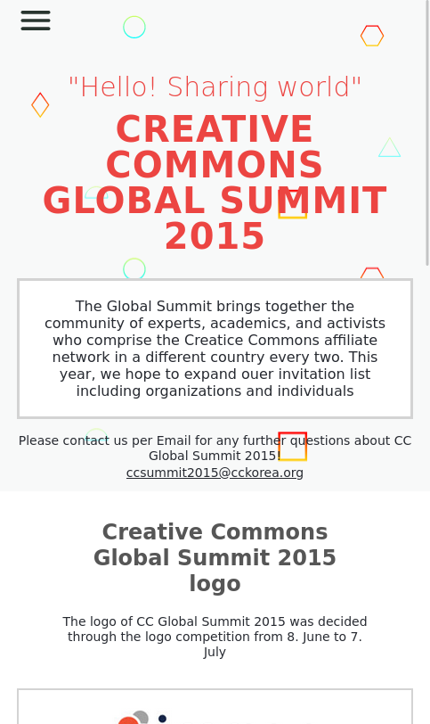
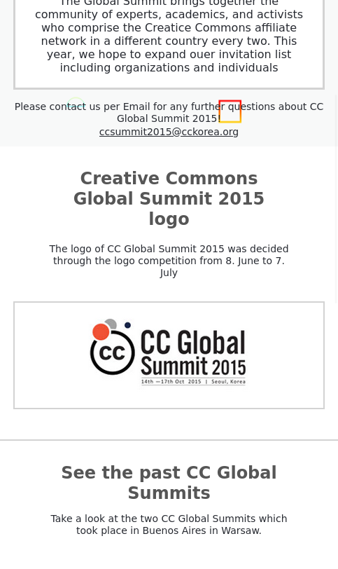
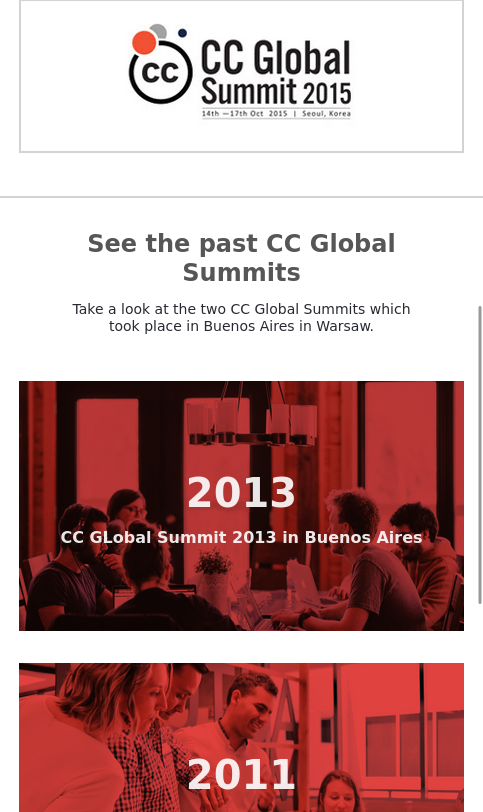
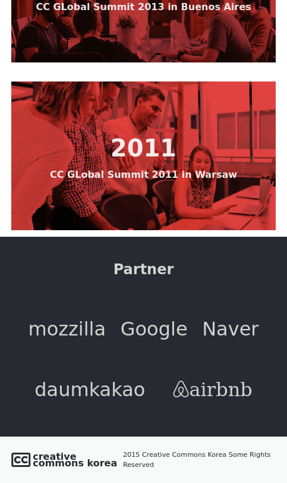

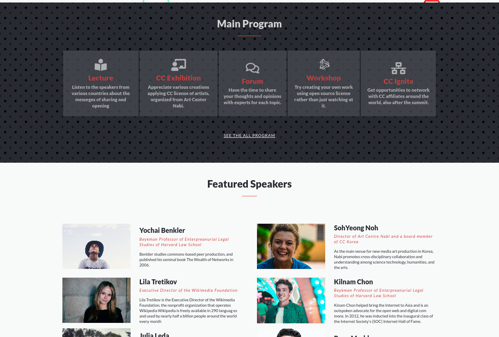
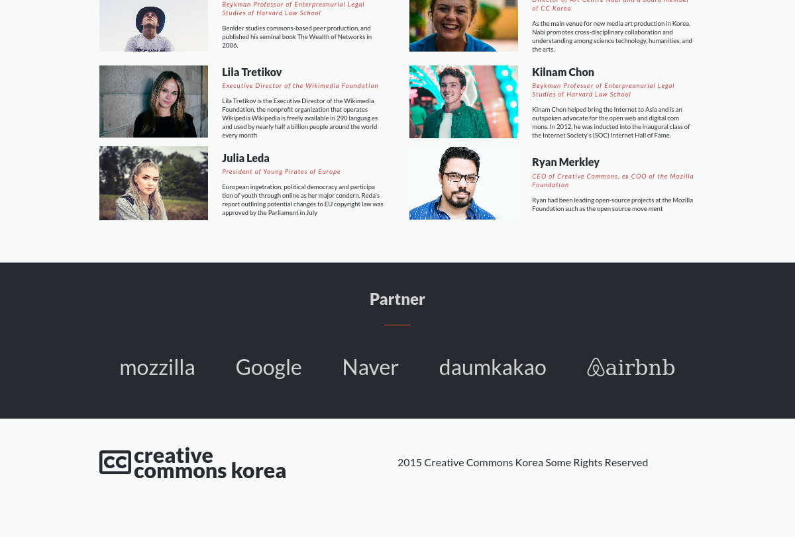

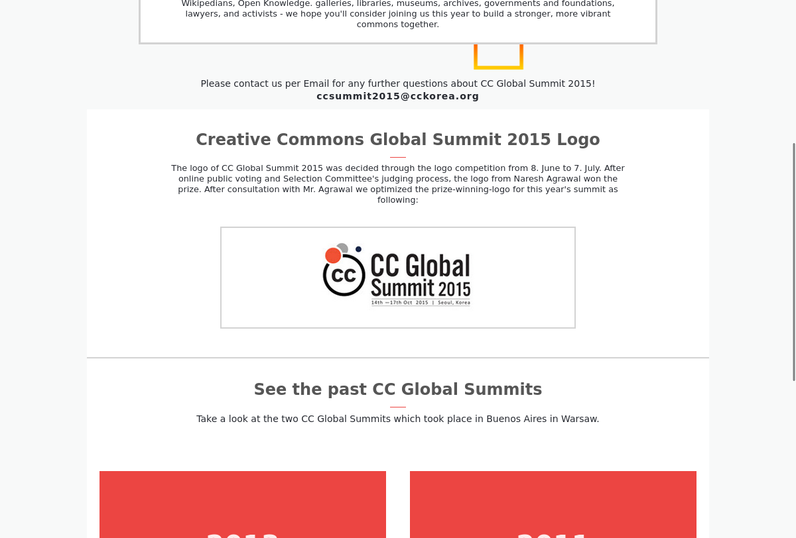
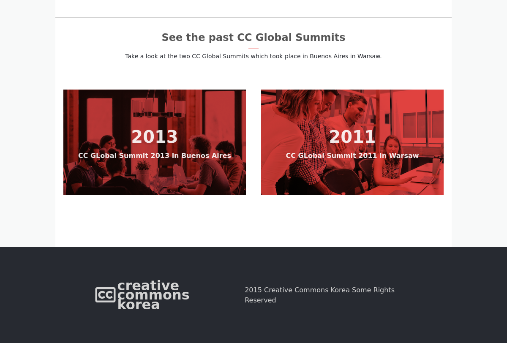
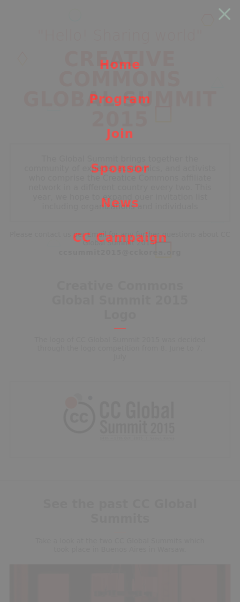

## Built With

- HTML, CSS, JavaScript

## Getting Started

To get a local copy up follow these simple example steps.

### Prerequisites

- GIT

### Setup

Open a terminal or a git bash in the desired directory and run `https://github.com/hendridg/capstone-module-1.git`

👤 **Author1**

- GitHub: [@hendridg](https://github.com/hendridg)
- Twitter: [@hendridg](https://twitter.com/hendridg)
- LinkedIn: [LinkedIn](https://linkedin.com/in/hendridg)

## 📝 License

This project is [MIT](./MIT.md) licensed.
